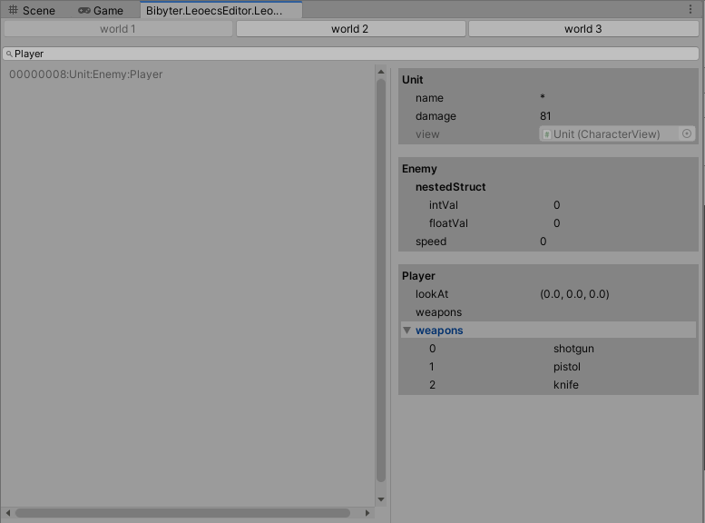
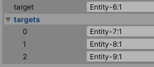

# leoecs-unityintegraion with EditorWindow


# How open window?
Window/Leoecs Editor

# How to connect The EcsWorld?
```csharp
void Start () {        
    _world = new EcsWorld ();
    _systems = new EcsSystems (_world);
#if UNITY_EDITOR
    Bibyter.LeoecsEditor.EcsEditorRouter.Create(_world);
#endif
    _systems
        .Add (new TestSystem1 ())
        .Init ();
}
```

# What can it do?
- view entities list
- List<> in component draw support
- filtering entity by component type name
- open multiple worlds
- nested struct draw support with attribute
```csharp
    [FullDrawInEcsWindow]
    struct NestedStruct
    {
        public int intVal;
        public int floatVal;
    }
```
- select entity with view object
```csharp
    public class CharacterView : MonoBehaviour
    {
        public EcsEntity entity;

        [ContextMenu("ShowEntityInEditor")]
        void ShowEntityInEditor()
        {
            EcsEditorRouter.SelectEntity(entity);
        }
    }
```
- selected entity with component field


